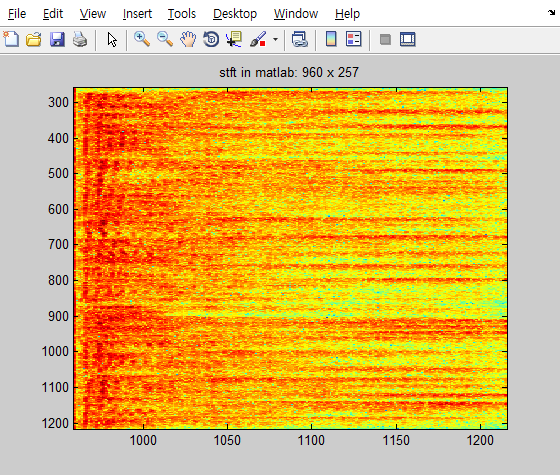
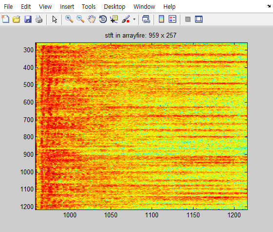

# arrayfire_online_stft_istft
Short time fourier transform implemented arrayfire for online audio processing.

## support data type, structure

- raw data -> frequency domain data (stft)

|  |type            |dimension  |
|--|----------------|-----------|
|in |af::array(c32)  |(Shift size) x number of channels|
|out|af::array(c32)  |(FFT size / 2 + 1) x number of channels|
  
- frequency domain data -> raw data (istft)

|  |type            |dimension  |
|--|----------------|-----------|
|in |af::array(c32)  |(FFT size / 2 + 1) x number of channels|
|out|af::array(f32)  |(Shift size) x number of channels|

## example

```cpp
    typedef af::array arr;

    float** buffer; // buffer[nChannels][nBlocks];
    int nBlocks = wm::wread("wav_7ch.wav", buffer);

    /* ... skipped ...*/
    
    /* copy float pointer -> af::array */
    for (int i = 0; i < nCh; i++)
    {
        samples(af::span, i) = arr(nBlocks, (&buffer[i][0]), afHost).as(c32);
    }
    
    arr frame = af::constant(0.0f, nfreq, c32);

    for (int i = 0; i < nbuffers; i++)
    {
        int start = i * sshift;
        
        /* get new shifted samples */
        arr arrived = samples(seq(start, start + sshift - 1), af::span);
        
        /* time domain -> freq domain */
        frame = pstft->stft(arrived);
        
        /* freq domain -> time domain */
        processed(seq(start, start + sshift - 1), af::span) = pstft->istft(frame, false);
    }
```
## result


+------------------+-------------------+
|      |     |
+------------------+-------------------+
|     |     |
+------------------+-------------------+


## precaution

- This code is not tested enough.

